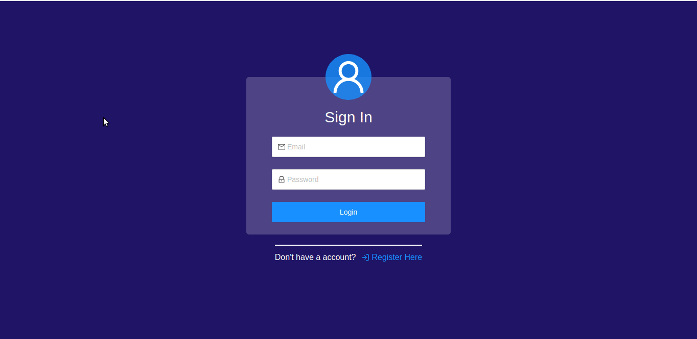

<p align="center">
<a href="#about">About</a>&nbsp;&nbsp;&nbsp;|&nbsp;&nbsp;&nbsp;
  <a href="#technologies">Technologies</a>&nbsp;&nbsp;&nbsp;|&nbsp;&nbsp;&nbsp;
  <a href="#how-to-install-and-start">How to install and start</a>
</p>


## About
Project carried out for the selection process at Adopets

---

##  Technologies
Technologies used:

### Backend:
-  [Node.js](nodejs)
-  [Sequelize](https://sequelize.org/)
-  [PostgreSQL](https://www.postgresql.org/)
-  [Winston](https://www.npmjs.com/package/winston) ( _api logs_ )

### Frontend:
-  [ReactJS](https://reactjs.org/)
-  [Ant Design](https://ant.design/)


## How to install and start

```bash

  # Clone this repository
  $ git clone https://github.com/DaywisonFerreira/adopets-backend.git

  # Change the settings for the .env.example variable to enter the database credentials

  # Install dependencies
  $ yarn install

  # Run migrations
  $ yarn sequelize db:migrate

  # Run seeds to save products in database
  $ yarn sequelize db:seed:all

  # Run server
  $ yarn dev

  ## Front end
  # Clone this repository
  $ git clone https://github.com/DaywisonFerreira/adopets-frontend.git

  # Install dependencies
  $ yarn install

  # Run
  $ yarn start


  ```

## API Logs
#### log info :arrow_right: /src/logs/info.log
#### log error :arrow_right: /src/logs/error.log
  ----
### Made with :heart: by Daywison Leal
-  [LinkedIn](https://www.linkedin.com/in/daywison-leal/)


